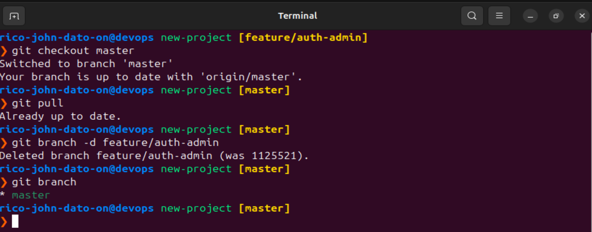

# 🧹 Deleting Git Branches - Cleanup Best Practices

When working with Git, especially in teams, managing branches properly is essential for keeping your repository clean and understandable.

## ✅ After Merging a Branch

Once a feature or bug-fix branch is merged into `master` (or `main`), you have **two options**:

### 1. 🗑️ Delete the branch (Recommended)

- **Why?**
  - Keeps the branch list short and meaningful.
  - Avoids confusion over which branches are active.
  - Ensures only ongoing work is visible.

Deleting a branch **remotely**,

```bash
# Delete remote branch
git push origin --delete feature/auth-admin
```


Even after deleting a branch **remotely**, your local version still exists.

```bash
# You may get a warning that the remote branch no longer exists
# Clean it up locally

# Make sure you're not on the branch you're deleting
git checkout master
git pull

git branch -d feature/my-feature
```



If someone needs to make changes later:

- Create a new branch (e.g., `bugfix/my-feature` or `enhancement/my-feature-2`).

### 2. 🧷 Keep the branch (Not Recommended)

- Might be useful if you anticipate immediate follow-up changes.
- But can lead to:
  - Hundreds of branches cluttering the repo.
  - Difficulty tracking what's merged, active, or abandoned.

## 🚨 Protected Branches

- `master` or `main` is usually protected:
  - Can't be deleted
  - Can be restricted from direct pushing (only PRs allowed)

---

### 🧠 Summary

| Action               | Command                                |
| -------------------- | -------------------------------------- |
| Delete remote branch | `git push origin --delete branch-name` |
| Delete local branch  | `git branch -d branch-name`            |
| Switch to master     | `git checkout master`                  |
| Pull latest changes  | `git pull`                             |

---

📘 Follow best practices:

- Delete branches after merging.
- Keep your repo clean and easy to manage.
